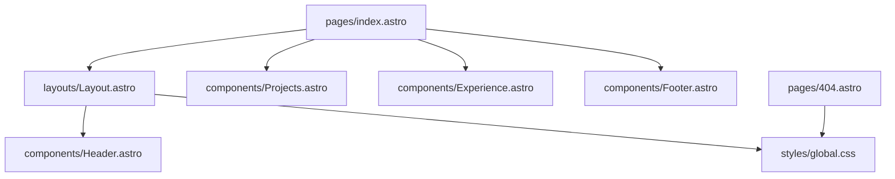

# ddossett.com

The personal website of **David Dossett**, a product designer at GitHub on the Copilot Labs team and formerly design lead for VS Code. It lives at [ddossett.com](https://ddossett.com).

The site is intentionally small. It's a single, text-first page: a short introduction, a list of selected projects, a timeline of experience, and a few social links. There are no case-study galleries, card grids, or decorative effects — the goal is for a visitor to understand who David is, what he's worked on, and where he's worked within a few seconds of scanning. In the words of the project's own [`PRODUCT.md`](PRODUCT.md), the personality is *"quiet, precise, and technically confident."*

Under the hood it's an [Astro](https://astro.build) project that compiles to plain static HTML and CSS, and is deployed to GitHub Pages on every push to `main`.

## Table of contents

- [What's on the site](#whats-on-the-site)
- [Design principles](#design-principles)
- [Tech stack](#tech-stack)
- [Getting started](#getting-started)
- [Available scripts](#available-scripts)
- [Project structure](#project-structure)
- [How the page is put together](#how-the-page-is-put-together)
- [Editing content](#editing-content)
- [Styling and theming](#styling-and-theming)
- [Configuration](#configuration)
- [Deployment](#deployment)
- [Design documentation and AI tooling](#design-documentation-and-ai-tooling)
- [Credits](#credits)

## What's on the site

The home page (`src/pages/index.astro`) is composed of four parts:

| Section        | Source                              | What it shows                                                                 |
| -------------- | ----------------------------------- | ----------------------------------------------------------------------------- |
| **Header**     | `src/components/Header.astro`       | A 48px circular avatar, David's name, and his role.                           |
| **About**      | `src/pages/index.astro`             | A two-paragraph introduction with inline links to GitHub, Copilot, and VS Code. |
| **Projects**   | `src/components/Projects.astro`     | Selected work, each row linking out to the project (opens in a new tab).      |
| **Experience** | `src/components/Experience.astro`   | Roles, companies, and years, newest first.                                    |
| **Footer**     | `src/components/Footer.astro`       | Links to Twitter, GitHub, and LinkedIn.                                       |

There is also a custom **404 page** (`src/pages/404.astro`) marked `noindex`.

Other details worth knowing:

- **Automatic light and dark mode** driven by `prefers-color-scheme`, with no toggle and no JavaScript.
- **Open Graph and Twitter card metadata** generated for every page from the layout's `title` and `description` props.
- **A "(Dev)" title suffix** is appended in development (`import.meta.env.DEV`), so a local tab is easy to tell apart from production.
- **Self-hosted typography**: Inter Variable is served from `public/fonts/` and preloaded, with a metrically adjusted Arial fallback to minimize layout shift while it loads.
- **Accessible by default**: semantic landmarks and headings, `aria-labelledby` on sections, visible focus outlines on all links, and WCAG AA contrast targets.

## Design principles

The visual system is documented in detail in [`DESIGN.md`](DESIGN.md), and the product intent in [`PRODUCT.md`](PRODUCT.md). A few highlights:

- **A 692px page measure** with 24px side padding, so the page reads like a single column of prose.
- **The One-Size Rule** — almost all text is `1rem`; hierarchy comes from weight, color, grouping, and space rather than large headings.
- **Flat by default** — no shadows, glass, or gradients. The only surface treatment is a quiet hover fill on linked project rows.
- **Color clarifies, it doesn't decorate** — neutral OKLCH ramps for light and dark, with a single orange accent reserved for text selection.

If you're changing the look of the site, read `DESIGN.md` first; it captures the reasoning behind each value in `global.css`.

## Tech stack

| Concern        | Choice                                                                 |
| -------------- | ---------------------------------------------------------------------- |
| Framework      | [Astro](https://astro.build) 7 (static output)                         |
| Language       | TypeScript (via Astro's `strict` tsconfig preset)                      |
| Type checking  | [`@astrojs/check`](https://docs.astro.build/en/reference/cli-reference/#astro-check) |
| Styling        | A single hand-written global stylesheet using CSS custom properties and OKLCH colors |
| Font           | [Inter Variable](https://rsms.me/inter/), self-hosted                  |
| Hosting        | GitHub Pages, with a custom domain (`public/CNAME`)                    |
| CI/CD          | GitHub Actions (`.github/workflows/astro.yml`)                         |

There are no UI frameworks, CSS frameworks, or client-side JavaScript dependencies — `astro` is the only runtime dependency.

## Getting started

### Prerequisites

- **Node.js 22.12.0 or newer.** This is the minimum required by Astro 7. CI builds with Node 24.
- **npm** (bundled with Node). The repository ships a `package-lock.json`, so npm is the expected package manager.

### Install

```sh
git clone https://github.com/daviddossett/ddos.git
cd ddos
npm install
```

### Run the development server

```sh
npm run dev
```

Astro will print a local URL (by default `http://localhost:4321`). Edits to `.astro` files and `global.css` hot-reload in the browser. You'll notice the tab title reads **"David Dossett (Dev)"** — that's expected in development.

### Check and build

```sh
npm run lint     # type-check and diagnose all .astro files
npm run build    # produce the static site in dist/
npm run preview  # serve dist/ locally to verify the production build
```

There is no automated test suite. `npm run lint` (which runs `astro check`) is the project's correctness gate, and CI runs it before every build.

## Available scripts

All scripts are defined in [`package.json`](package.json):

| Script            | Command          | Purpose                                                        |
| ----------------- | ---------------- | -------------------------------------------------------------- |
| `npm run dev`     | `astro dev`      | Start the local development server with hot reload.            |
| `npm start`       | `astro dev`      | Alias for `dev`.                                               |
| `npm run lint`    | `astro check`    | Run Astro's type checker and diagnostics across the project.   |
| `npm run build`   | `astro build`    | Build the production site into `dist/`.                        |
| `npm run preview` | `astro preview`  | Serve the built `dist/` output locally.                        |

## Project structure

```text
.
├── .github/
│   ├── skills/impeccable/   # Agent skill used for design work (see below)
│   └── workflows/astro.yml  # Build + deploy to GitHub Pages
├── public/                  # Copied verbatim into the build output
│   ├── CNAME                # Custom domain: ddossett.com
│   ├── favicon.ico
│   ├── favicon.png
│   ├── fonts/               # InterVariable.woff2 + its OFL license
│   └── images/              # david-avatar.webp
├── src/
│   ├── components/
│   │   ├── Experience.astro # Work history list
│   │   ├── Footer.astro     # Social links
│   │   ├── Header.astro     # Avatar, name, role
│   │   └── Projects.astro   # Linked project list
│   ├── layouts/
│   │   └── Layout.astro     # <head>, metadata, font preload, page shell
│   ├── pages/
│   │   ├── 404.astro        # Not-found page
│   │   └── index.astro      # Home page
│   └── styles/
│       └── global.css       # All site styles and color tokens
├── astro.config.mjs         # Astro config (sets the canonical site URL)
├── DESIGN.md                # Design system documentation
├── PRODUCT.md               # Product purpose, audience, and principles
├── package.json
└── tsconfig.json            # Extends astro/tsconfigs/strict
```

## How the page is put together

Astro uses file-based routing, so every file in `src/pages/` becomes a route: `index.astro` → `/` and `404.astro` → `/404.html`.



- **`Layout.astro`** owns the document shell. It accepts optional `title` (default `"David Dossett"`) and `description` (default `"Product designer at GitHub"`) props, writes the `<title>`, description, Open Graph, and Twitter meta tags, builds a canonical page URL from the configured `site`, preloads the font, and wraps everything in a centered `.site-shell` container with the `Header` at the top.
- **`index.astro`** renders inside the layout and supplies the About copy, then composes `Projects`, `Experience`, and `Footer`.
- **`404.astro`** is self-contained: it imports `global.css` directly but deliberately skips the shared layout, rendering a minimal centered "404 | This page could not be found." message.

Everything is rendered at build time. No JavaScript is shipped to the browser.

## Editing content

Most content changes are simple edits to typed arrays at the top of a component:

- **Add or reorder a project** — edit the `projects` array in `src/components/Projects.astro`. Each entry is `{ title, description, href }`, and every project row is a link.
- **Update work history** — edit the `experiences` array in `src/components/Experience.astro`. Each entry is `{ title, company, description }`, where `description` holds the date range. Entries render in array order, so keep the newest first.
- **Change the intro** — edit the About section markup directly in `src/pages/index.astro`.
- **Change the name, role, or avatar** — edit `src/components/Header.astro`, and replace `public/images/david-avatar.webp` if needed.
- **Change social links** — edit `src/components/Footer.astro`.
- **Change default page metadata** — edit the default props in `src/layouts/Layout.astro`.

Because components are type-checked under Astro's strict preset, run `npm run lint` after editing to catch mistakes like a missing field.

## Styling and theming

All styles live in [`src/styles/global.css`](src/styles/global.css). Colors are defined as CSS custom properties on `:root` and redefined inside a `prefers-color-scheme: dark` media query:

| Token          | Role                                                     |
| -------------- | -------------------------------------------------------- |
| `--canvas`     | Page background                                          |
| `--ink`        | Primary text                                             |
| `--muted`      | Supporting copy (intro text, role, focus outline)        |
| `--metadata`   | Project/experience descriptions and footer links         |
| `--quaternary` | Non-text decoration only (e.g. link underline tint)      |
| `--hover`      | Hover fill for linked project rows                       |
| `--accent`     | Orange text-selection highlight                          |

Layout is responsive with two breakpoints, at `40rem` (640px) and `48rem` (768px), which increase vertical rhythm and give project rows their taller desktop treatment. When adding or adjusting a color, keep the light and dark values in sync and check that text still meets WCAG AA contrast — `DESIGN.md` notes which tones are safe for text.

## Configuration

- **`astro.config.mjs`** sets `site: "https://ddossett.com"`. Astro uses this as the base for absolute URLs; the layout relies on it for the `og:url` tag. If you fork the site for another domain, change it here.
- **`public/CNAME`** tells GitHub Pages which custom domain to serve. Update it alongside `site` if the domain changes.
- **`tsconfig.json`** extends `astro/tsconfigs/strict` and includes Astro's generated types in `.astro/`.

**Environment variables:** none are required. The only environment value the code reads is Astro's built-in `import.meta.env.DEV`. (`.gitignore` excludes `.env*` files as a precaution, but nothing in the project consumes them.)

## Deployment

Deployment is fully automated by [`.github/workflows/astro.yml`](.github/workflows/astro.yml), which runs on every push to `main` and can also be triggered manually via **workflow_dispatch**:

1. **Build job** (Ubuntu, Node 24):
   - Installs dependencies with `npm ci`.
   - Runs `npm run lint` — a failing check stops the deploy.
   - Runs `npm run build`.
   - Uploads `dist/` as a GitHub Pages artifact.
2. **Deploy job**: publishes the artifact to the `github-pages` environment using `actions/deploy-pages`.

Deploys are serialized through a `pages` concurrency group, and in-progress deploys are not cancelled. Because `public/CNAME` is copied into `dist/`, the site is served at [ddossett.com](https://ddossett.com).

To ship a change, merge it to `main`. There's nothing else to do.

## Design documentation and AI tooling

This repository is set up to work well with AI coding agents on design tasks:

- **`PRODUCT.md`** describes who the site is for, what success looks like, the brand personality, anti-references, and accessibility commitments.
- **`DESIGN.md`** is a machine- and human-readable design system: YAML front matter with color, typography, spacing, and component tokens, followed by prose rules and do's and don'ts.
- **`.github/skills/impeccable/`** contains the *Impeccable* agent skill (Apache 2.0), which reads `PRODUCT.md` and `DESIGN.md` as context before doing design work such as audits, critiques, and polish passes. Its local configuration lives in `.impeccable/`.

If you're asking an agent to change the site's look or copy, pointing it at these two documents is the fastest way to get results that fit.

## Credits

- Typeface: [Inter](https://github.com/rsms/inter) by The Inter Project Authors, licensed under the SIL Open Font License 1.1 (see `public/fonts/LICENSE.txt`).
- Built with [Astro](https://astro.build).
